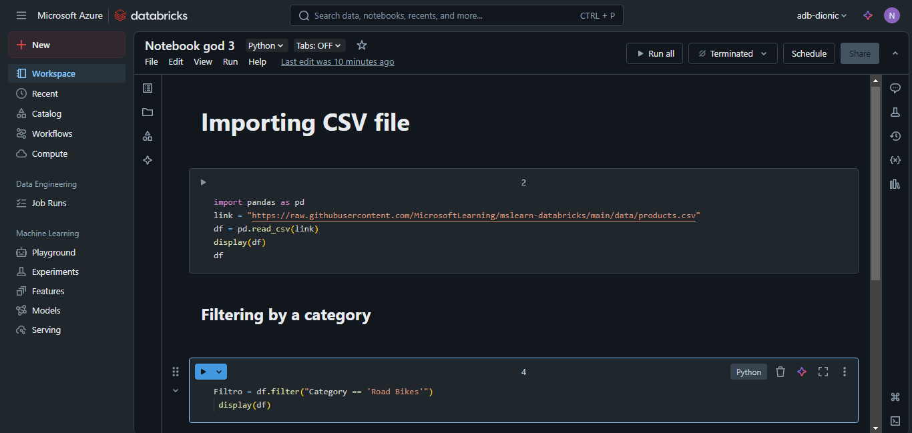
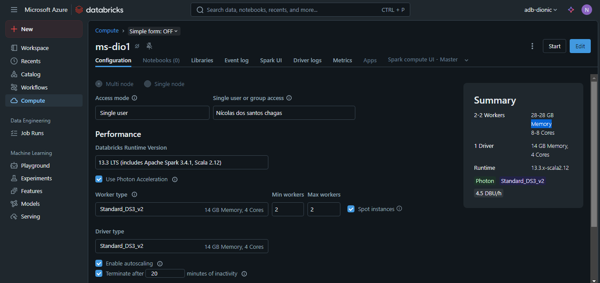
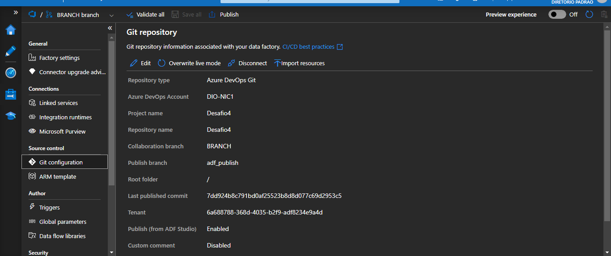
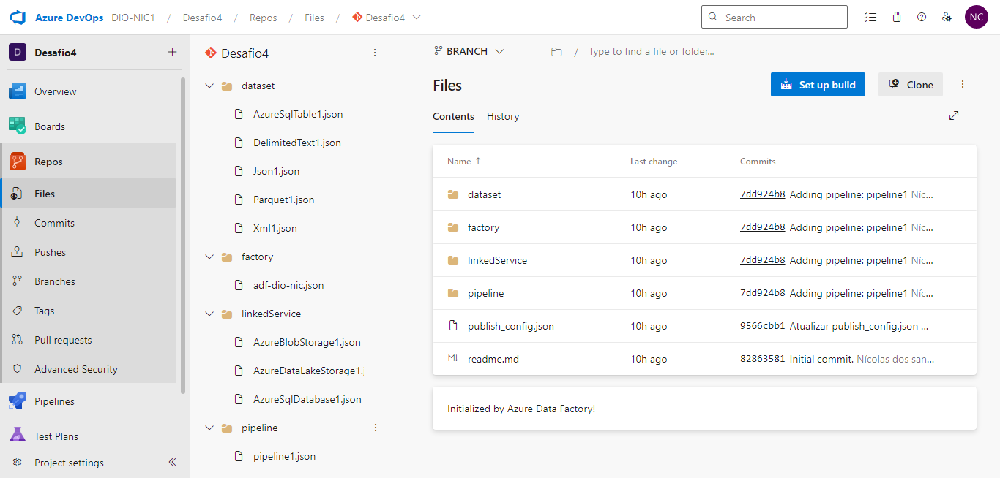

# Desafios 03 e 04 do Bootcamp "Microsoft AI for Tech - Azure Databricks" - DIO

Este repositório reúne a entrega dos **desafios 3 e 4** do Bootcamp da DIO, ministrado pela professora **Carol**. Ambos estão organizados juntos neste repositório, já que compartilham a continuidade prática do aprendizado anterior e envolvem conexões com os serviços já criados nos desafios 1 e 2.

---

## Desafio 03 - Controle e Versionamento de Código no Notebook da Azure

### Contexto do Desafio

Neste desafio, a proposta foi explorar o serviço **Azure Databricks**, seguindo um roteiro proposto pela **plataforma Microsoft Learning**, com foco na criação de um **cluster**, manipulação de **dados em CSV** com **Pandas**, e realização de filtros simples via notebook.

### O Que a Professora Carol Fez

- Criou um **serviço Databricks** no Azure.
- Criou um **cluster** com configurações fornecidas pelo exercício da Microsoft Learning.
- Criou um **notebook** no Databricks e, com a biblioteca **Pandas**, realizou:
  - A **leitura de um arquivo CSV**.
  - Um **filtro simples** nos dados importados.

### O Que Eu Fiz

Segui os mesmos passos do exercício, replicando o processo com sucesso. No entanto, fiz uma alteração na **configuração do cluster**:

- **Escolhi criar um cluster mais básico**, com menos recursos, adequado para o meu uso e suficiente para realizar as tarefas propostas.

### Ferramentas Utilizadas

- Azure Databricks  
- Cluster (com especificações personalizadas)  
- Python (com biblioteca Pandas)  
- Notebook Databricks  
- Arquivo CSV fornecido no exercício

### Evidências

- **Imagem 1**: Cluster criado no Databricks

 

- **Imagem 2**: Notebook com código de leitura e filtro de dados usando Pandas

 

---

## Desafio 04 - Github e Azure Devops para Versionamento e Backups

### Contexto do Desafio

Este desafio teve como objetivo configurar o ambiente de **integração entre o Azure DevOps e o Azure Data Factory**, prática essencial para o controle de versionamento e colaboração em pipelines de dados.

### O Que a Professora Carol Fez

- Criou uma **conta no Azure DevOps**.
- Criou um **projeto e ambiente** dentro da plataforma.
- Criou um **novo Azure Data Factory**, com o único propósito de conectá-lo ao DevOps.
- Estabeleceu a **conexão entre o Data Factory e o repositório DevOps**, permitindo o versionamento dos pipelines.

### O Que Eu Fiz

Segui o mesmo processo de criação e integração, mas optei por uma abordagem mais enxuta:

- Em vez de criar um novo Data Factory, **utilizei o mesmo Data Factory já existente dos desafios 1 e 2**, evitando duplicidade de recursos e mantendo a organização centralizada.
- Criei a conta no Azure DevOps, configurei o projeto e **conectei o repositório ao meu Data Factory principal**.

### Justificativa da Escolha

A decisão de reutilizar o mesmo Data Factory foi baseada na **praticidade e consistência do ambiente**. Não identifiquei a necessidade de criar um novo recurso apenas para realizar essa integração, uma vez que todas as funcionalidades foram preservadas.

### Ferramentas Utilizadas

- Azure DevOps  
- Azure Data Factory (existente)  
- Repositório Git

### Evidências

- **Imagem 3**: Tela de integração do DevOps com o Data Factory  

 

- **Imagem 4**: Projeto criado no Azure DevOps

 

---

## Considerações Finais

- No desafio 3, a utilização do Databricks permitiu trabalhar com notebooks e dados em nuvem, consolidando o uso de ferramentas analíticas modernas. A escolha por um cluster mais básico foi estratégica e funcional.
- No desafio 4, a decisão de reaproveitar o Data Factory existente foi feita para manter uma estrutura mais limpa e evitar redundâncias, sem comprometer nenhuma funcionalidade esperada.
- Assim como nos desafios anteriores, todas as soluções foram baseadas nas instruções da professora **Carol**, com adaptações quando necessário.

---

**Autor:** [Seu Nome]  
**Bootcamp:** Microsoft AI for Tech - Azure Databricks  
**Plataforma:** DIO (Digital Innovation One)  
**Instrutora:** Carol
